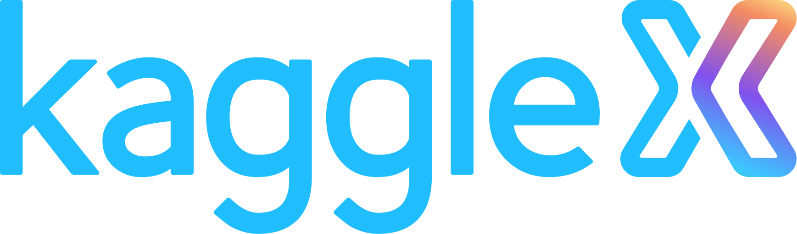

  # QnA_ESGreports
  
  # __Question-and-Answer app to explore ESG reports using RAG-LLM__

 This project is developed as a part of KaagleX BIPOC mentorship program.

## About

 **_Q-n-A with ESG report using LLM_** is an end-to-end project based on Retrieval Augmentation Generation (RAG) concept where external information, in this case, Environmental-Social-Governance (ESG) reports, are provided to large language models (LLM). 

 ## Motivation

 Every company should produce a report informing how it accomplishes the responsibilities towards ESG complying with regulations. I have chosen reports of first 50 companies listed in S&P 500. ESG report is very important to gain trust of investors and stakeholders. Reports may be large with complex and cleverly written text. Manually finding all required information from the report can be tedious and time consuming. This is the motivation behind this project where user can get concise response along with referred page numbers from the report against their query.  

## How it works

 Front end of the app collects year, company name and query from the user, and then displays response with source page numbers. In the backend, report is fetched from GCP-bucket/repository. It gets processed to obtain embeddings.Then LLM retrieves related text chunks and creates concise response. Also returns the corresponding page numbers from metadata associated to text-chunks. This project is created on Google Cloud Platform (GCP). Reports are collected by web scrapping and stored in GCP Bucket. To render Streamlit app from GCP, the project use local tunnel and ipv4 utilities. 

